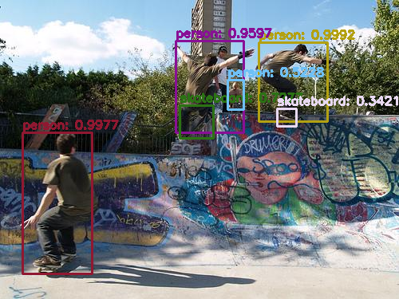

# Object Detection with YOLOv3 and coco128 Dataset

## Description

This project demonstrates object detection using a pre-trained YOLOv3 model and OpenCV in a Google Colab environment. It utilizes the coco128 dataset for testing the model's performance on a variety of objects. 

The project implements functionalities for:

- Loading the pre-trained YOLOv3 model and configuration.
- Detecting objects in images using the YOLOv3 algorithm.
- Drawing bounding boxes around the detected objects.
- Labeling the objects with their respective classes and confidence scores.
- Visualizing the results with bounding boxes and labels overlaid on the original image.

The code is organized into functions for efficient object detection and visualization, making it easy to understand and modify.

## Installation

Before running the code, make sure you have the necessary libraries installed. You can install them using the following command:
bash pip install -r requirements.txt
This will install the following libraries:

- `opencv-python`
- `numpy`
- `matplotlib`
- `gradio` (if you are using Gradio for creating a web interface)

## Usage

1. **Download and Extract Images:** bash !wget [redacted link] !unzip coco128.zip
2. **Run the Code:**
    - Execute the code cells in your Google Colab notebook.
    - The code will load the pre-trained YOLOv3 model, process the images, perform object detection, and display the results with bounding boxes and labels.

## Examples

## Limitations

- The project uses a pre-trained YOLOv3 model, which may not be as accurate as models trained on specific datasets or fine-tuned for particular object classes.
- The accuracy of object detection can be affected by factors such as image quality, lighting conditions, and object occlusion.

## Contributing

Contributions to this project are welcome! If you find any bugs or have suggestions for improvement, please feel free to create an issue or submit a pull request.

## License

This project is licensed under the MIT License - see the [LICENSE](LICENSE) file for details.
